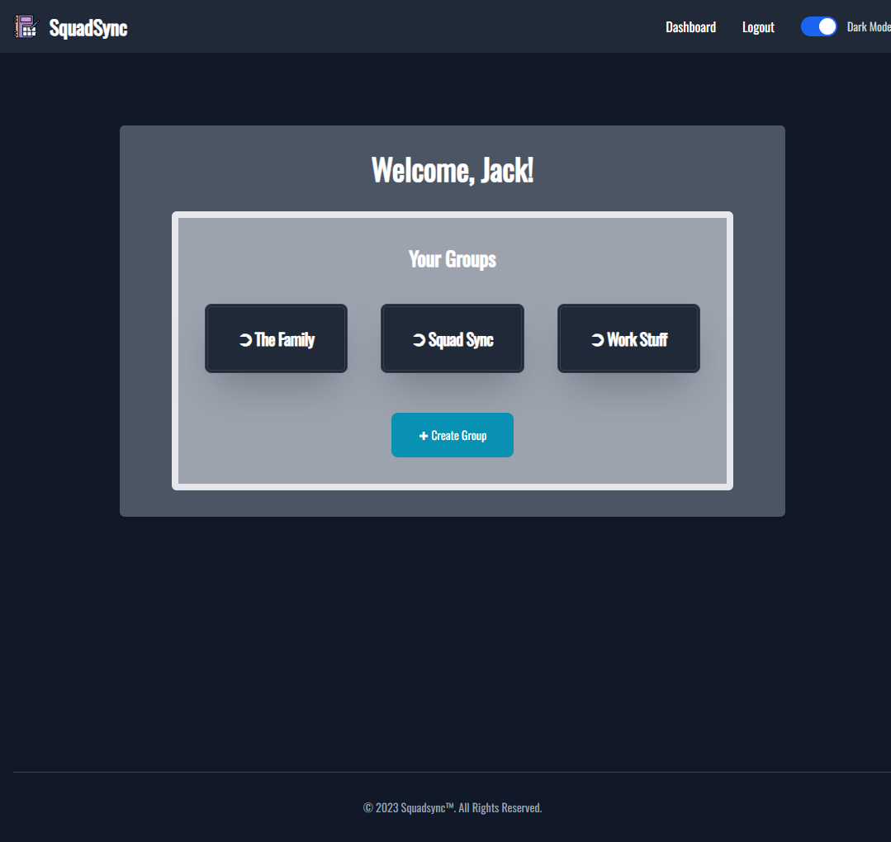

# SquadSync


## Description

SquadSync introduces an innovative application designed to effortlessly manage your tasks and lists. Drawing inspiration from the concept of a "HoneyDo" list, users can establish their accounts to meticulously organize their diverse lists. By incorporating technologies such as GraphQL, React, MongoDB and Tailwind to name a few, the app seamlessly centralizes these lists within your account and offers a comprehensive solution.

One of the standout features of SquadSync is its collaborative nature. Users can readily invite multiple participants to contribute to their individual lists, transcending the boundaries of solo task management. Imagine planning a bachelor party, where diverse contributors can collectively curate the perfect event by collaboratively adding and refining tasks. This synergy extends further as tasks can be allocated a priority status, portraying their significance within the grand scheme of things.

With SquadSync, empowerment and efficiency intertwine, ensuring your tasks and lists remain impeccably organized while fostering collaborative excellence.

## Table of Contents

1. [Installation](#installation)
2. [Instructions](#instructions)
3. [Motivations](#motivations)
4. [Deployed Application](#deployed-application)
5. [Questions](#questions)

## Installation

Download and install the Node.js LTS version from [Node.js](https://nodejs.org/en).

- Clone the repo
  ```sh
  git clone git@github.com:erikbenedict/squad-sync.git
  ```
- Install NPM packages
  ```sh
  npm i
  ```
- Run build
  ```sh
  npm run build
  ```
- Start the application
  ```sh
  npm run develop
  ```
- (!! IMPORTANT !!) Make sure to create a `.env` file in the server folder for teh `JWT_SECRET`

## Instructions

1. Click on the link in the Deployed Application section to start.
2. When the application has launched you will have to Signup and create a new account.
3. Once you have a new account created you will be taken to the Dashboard page where you can create your first group!
4. After your groups have been created you can add users to each group and start creating tasks.
5. Once the tasks have been made you can assign a priority to each task and even add a due date for the task to be completed.
6. Finally, once the task has been completed you can delete it and move on to the next one!

Below are screenshots of the application




## Motivations

Here is a list of our motivations for this project!

- Practice on working with a team to build a functioning application start to finish in under two weeks
- Make it easier to keep all of your ToDo's in one location where you won't lose them or forget
- Continue to have a better understanding working with GitHub workflow
- Work with React, MongoDB, GraphQL and JWT to create a working application while increasing our understanding in each of the universally used technologies
- Showcase our creativity while improving our habits of coding
- Create a space for people to come together and organize their lives even when they're not always so organized

## Deployed Application

[Click here to go our SquadSync application!](https://squad-sync-5e36d690cf8e.herokuapp.com/)

## Contributing

Contributions are what make the open source community such an amazing place to learn, inspire, and create. Any contributions you make are greatly appreciated.

If you have a suggestion that would make this better, please fork the repo and create a pull request. Don't forget to give the project a star! Thanks again!

1. Fork the Project
2. Create your Feature Branch (`git checkout -b feature/AmazingFeature`)
3. Commit your Changes (`git commit -m 'Add some AmazingFeature'`)
4. Push to the Branch (`git push origin feature/AmazingFeature`)
5. Open a Pull Request

## Questions

If you have any questions feel free to reach out to any of the team members below:

- Erik Benedict: - erik.r.benedict@gmail.com | [GitHub](https://github.com/erikbenedict)
- Jack Bulger: - jebulger1003@gmail.com | [GitHub](https://github.com/jebulger)
- Eric Wagner: - wagnd4e@gmail.com | [GitHub](https://github.com/SparkkyJD)
- Darren Johnson: - darrenj@oldschoolrenovation.com | [GitHub](https://github.com/Roadglide131)
- Daniel Schopler: - dmschopler@gmail.com | [GitHub](https://github.com/Dmschopler)
